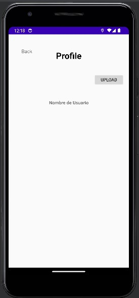

# KotlinProject_POU

## Workspace 
Github:  
- Repository: https://github.com/mfjclover/KotlinProject_POU   
- Releases: https://github.com/MattXu6/MovileAppDevelopment/releases 

Workspace: https://upm365.sharepoint.com/sites/Tracking/SitePages/Tracking.aspx
  

## Description
First of all this is app is specially designed for new students, where they can find the most interesting points of their university, we try to make a more enjoyable form for them to make famillier with every point.

## Screenshots and navigation
Include screenshots of the app in action. You can upload the images to GitHub and then reference them here using Markdown or HTML syntax:

<table>
  <tr>
    <td>
      
    </td>
    <td>
      
    </td>
  </tr>
  <tr>
    <td>
      
    </td>>
    <td>
      
    </td>
  </tr>
  <tr>
    <td>
    </td>
  </tr>
</table>

## Demo Videot here:  

## Features
List the **functional** features of the app. For example:
- Search for hot points in universities.
- User profile edit.
- Interactive maps.
- Real-time traffic information.

List the **technical** features of the app. You might include specific references to source code
in your repo. For example:
- Persistence in csv/text file
- Persistence in shared preferences
- Persistence in Room database.
- Firebase Realtime database
- Firebase authentication
- Maps: Openstreetmaps
- Menu: Bottom navigation.
- Sensors: GPS coordinates

## How to Use
First of all authenticate.
Select your university or directly the map in the bottom navigation bar, where you can find hot points of interest.
Also you can edit the user profile, finding it in the bottom navigation bar.

## Participants
List of MAD developers:
- Marcos Fu Jin (marcos.fu.jin@alumunos.upm.es)
- Matteo Xu (matteo.xu@alumunos.upm.es)  
